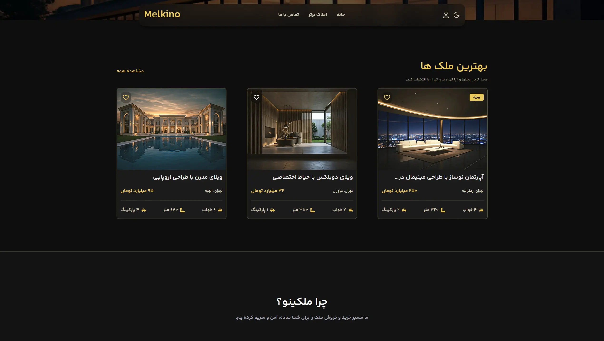
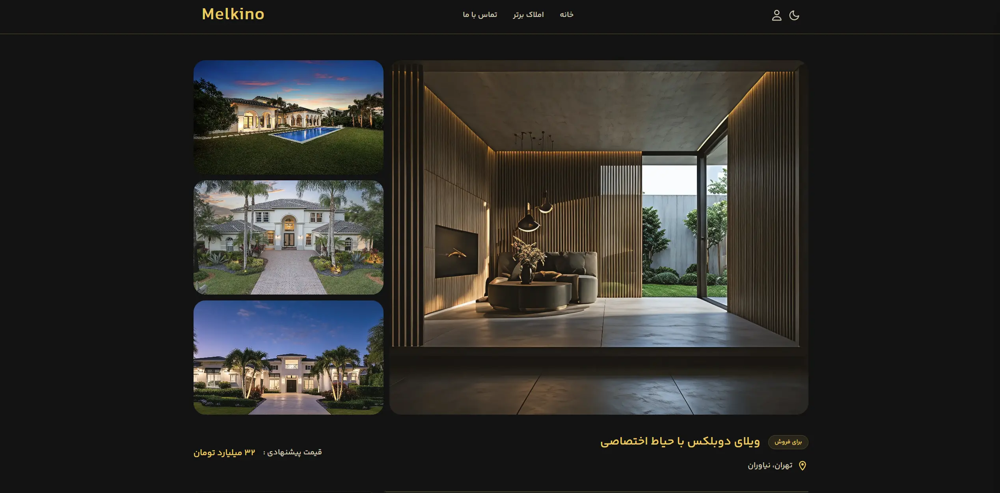
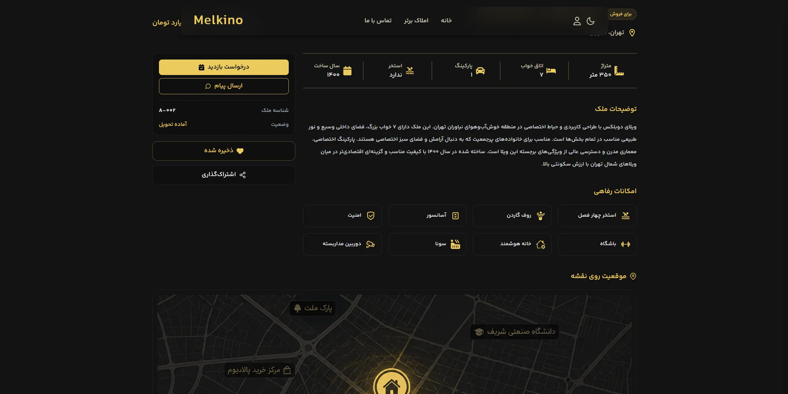
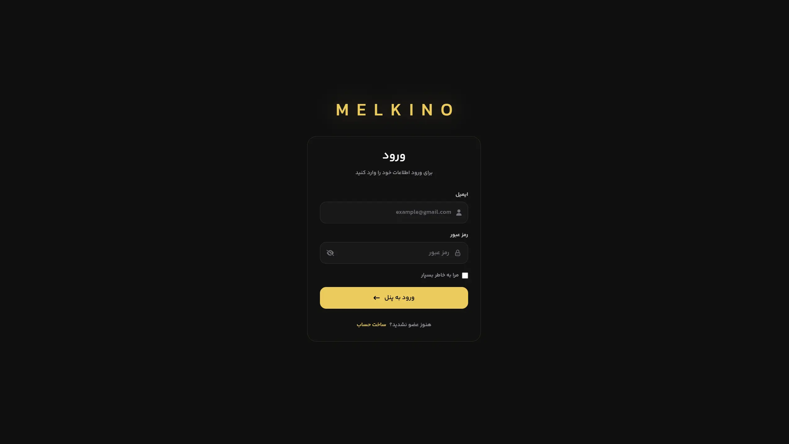
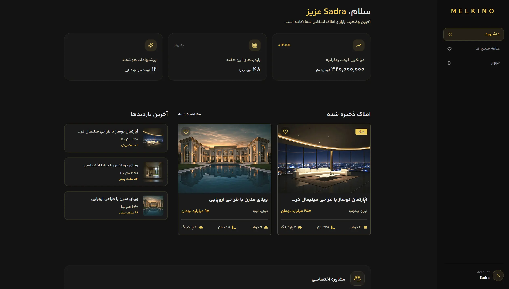
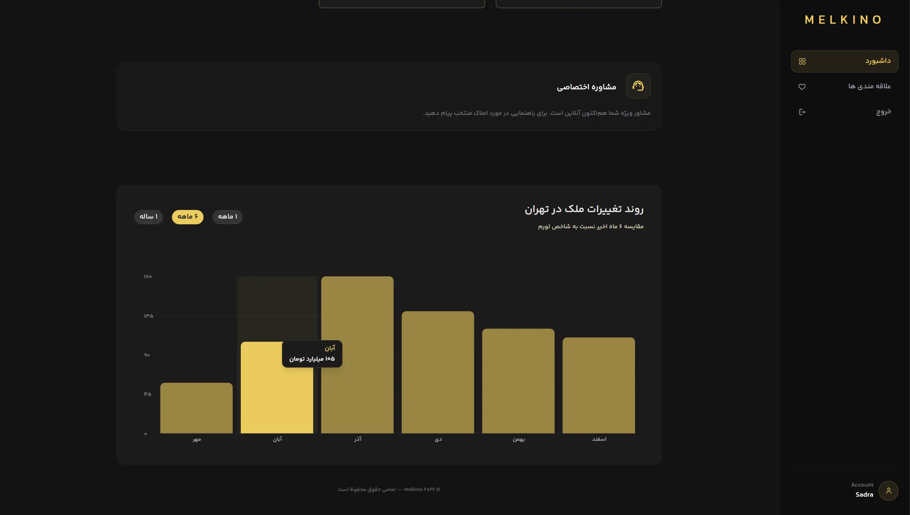

# Melkino

Melkino is a responsive real estate web application built with **React, Vite, Tailwind CSS v4, Node.js, and Express**.

The project combines a modern Persian/RTL interface with a lightweight REST API, user authentication, property listings, favorites, and dashboard functionality. It is structured as a full-stack application with separate frontend and backend workspaces.

---

## Overview

Melkino provides a responsive property browsing experience across desktop, tablet, and mobile devices.

The application includes property listings and detail pages, account-related features, saved properties, theme management, and frontend–backend communication through an Express REST API.

The interface is designed primarily for Persian users with full RTL support while keeping the codebase modular and maintainable.

---

## Features

* Responsive design for desktop, tablet, and mobile
* Persian and RTL interface
* Dark and Light themes
* Persistent theme preference
* Property listings
* Property detail pages
* User registration and login
* Favorites management
* User dashboard
* Client-side routing with React Router
* REST API with Express
* Local JSON-based data storage
* Tailwind CSS v4 styling

---

## Tech Stack

### Frontend

* React
* Vite
* Tailwind CSS v4
* React Router
* JavaScript

### Backend

* Node.js
* Express
* REST API
* JSON-based local data storage

---

## Preview

### Home Page




### Property Pages





### Login



### User Dashboard





---

## Getting Started

Clone the repository:

```bash
git clone https://github.com/sadra-nosrati/Melkino.git
```

Navigate to the project directory:

```bash
cd Melkino
```

Install the dependencies:

```bash
npm install
```

Start the development environment:

```bash
npm run dev
```

The development command starts both the **Vite frontend** and **Express backend**, so there is no need to run them manually in separate terminals.

During development, frontend requests to:

```text
/api
```

are proxied by Vite to the Express API server running on:

```text
http://localhost:5000
```

---

## Production Build

Create an optimized production build:

```bash
npm run build
```

The generated frontend files are available in:

```text
client/dist

---

## Demo Data

The project uses:

```text
server/db.json
```

as a lightweight local data source for development and demonstration.

It contains sample property information and can also store demo user data during local development.

> Do not commit real user information, passwords, authentication tokens, API keys, or other sensitive data to a public repository.

---

## Development Workflow

The root development script runs the frontend and backend workspaces together.

Conceptually, it starts:

```bash
npm run dev --workspace melkino
npm run dev --workspace server
```

Stopping the root development process terminates both services together. If either service exits unexpectedly, the other process is also stopped.

This keeps the local development environment synchronized and prevents unnecessary processes from remaining active.

---

## Key Implementation Areas

Melkino demonstrates practical implementation of:

* Component-based React architecture
* Responsive interface development
* RTL layout implementation
* Theme management
* Client-side routing
* Authentication flows
* Dynamic property data
* Favorites and user-specific interactions
* REST API integration
* Frontend and backend workspace management
* Maintainable project organization

---

## Author

**Sadra Nosrati**

Frontend Developer focused on building responsive, maintainable, and user-friendly web applications.

GitHub: `github.com/sadra-nosrati`

---

If you find the project useful, consider starring the repository.
